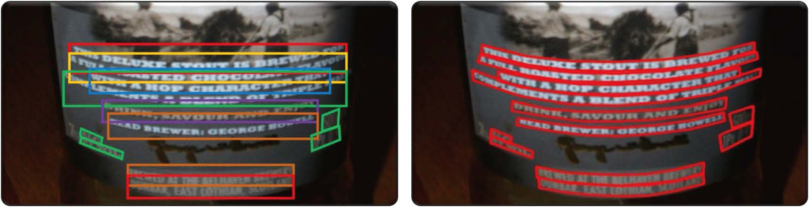
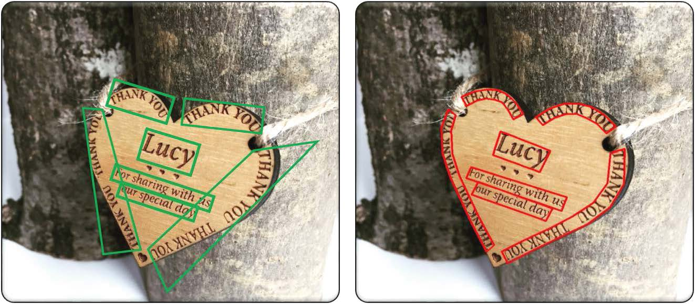
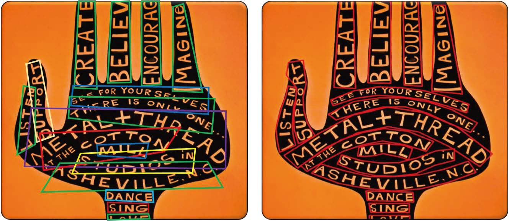
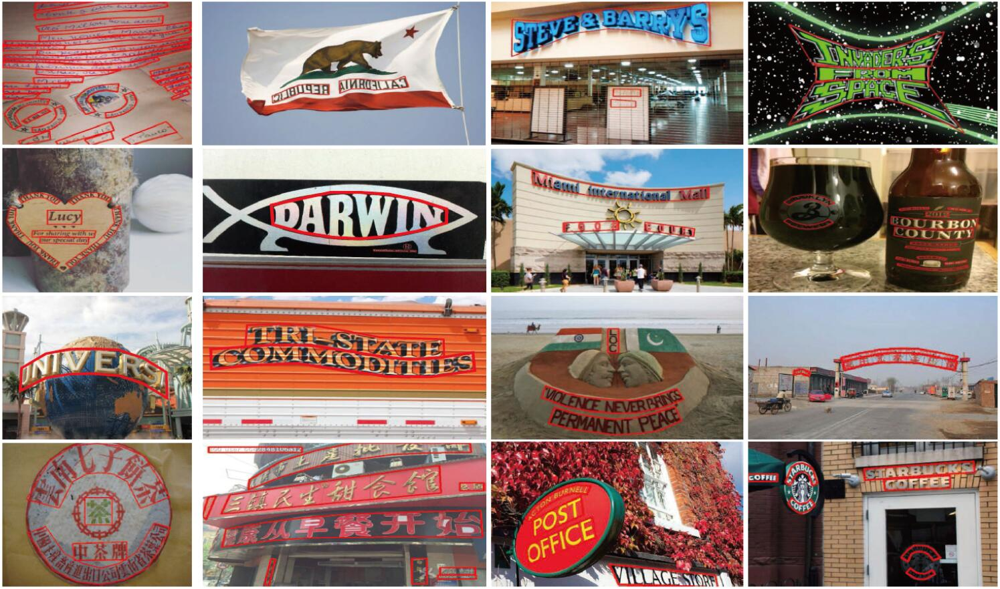
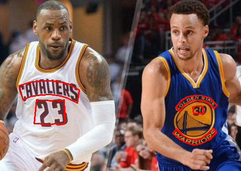
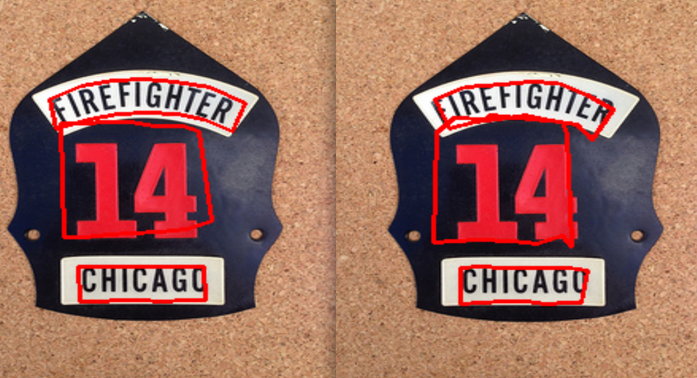
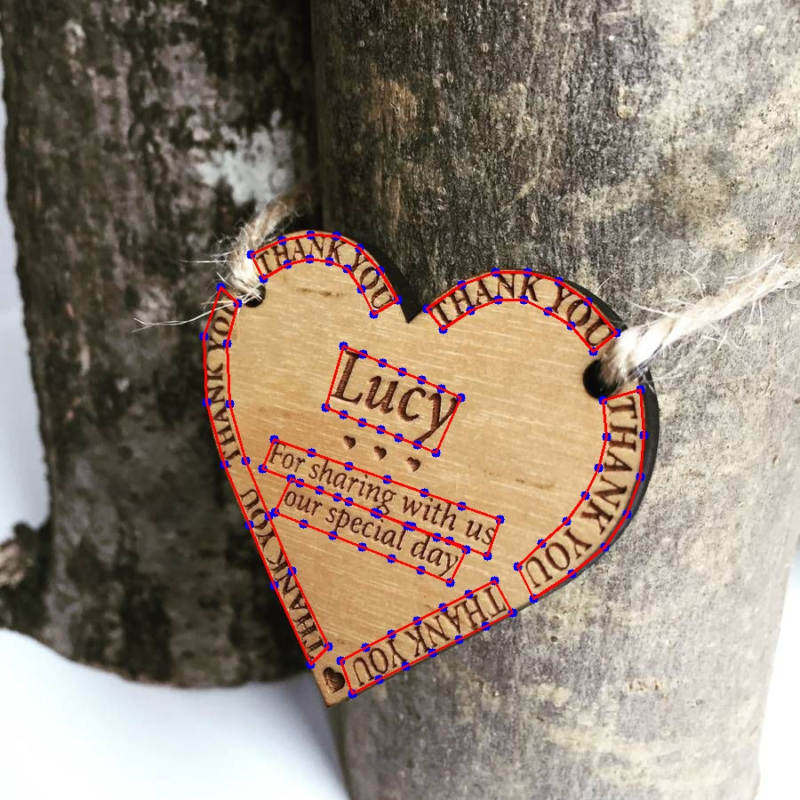
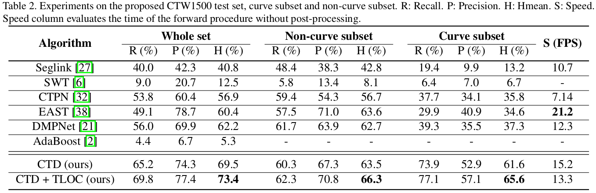
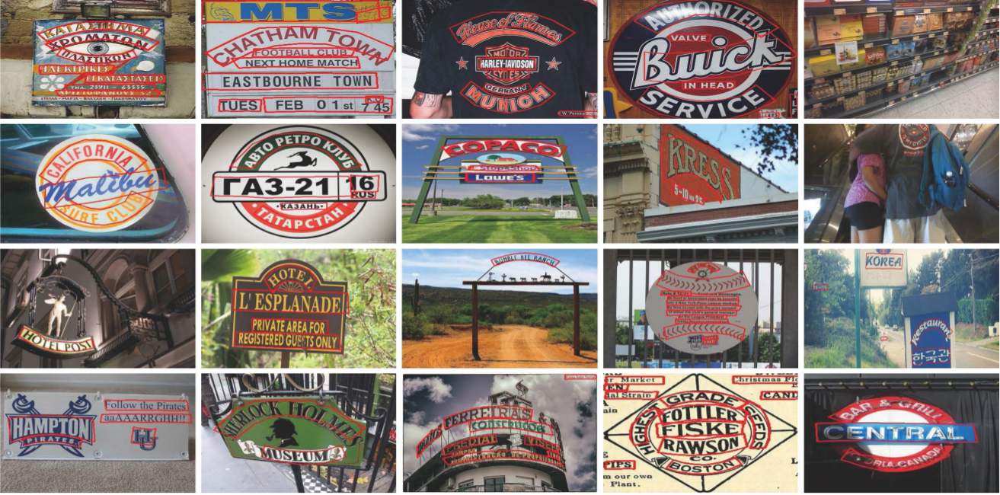

# Curve-Text-Detector

(Released on December 06, 2017)

# News

SCUT-CTW1500 is a text-line based dataset with both English and Chinese instances. If you are insterested in word-level based Engish curve text, we highly recommend you refer to [Total-text](https://github.com/cs-chan/Total-Text-Dataset). In addition, a recent ICDAR2019 Robust Reading Challenge on Arbitrary-Shaped Text ([ArT](http://rrc.cvc.uab.es/?ch=14)), which is extended from SCUT-CTW1500 and Total-text, is held for stimulating more improvements on the arbitrary-shaped text reading task. We welcome your participant, and the winner will be rewarded with substantial awards.


# Detection Results on SCUT-CTW1500

Text detection is far different from object dection as every tiny part of the text instance maybe valuable. Recently, [TIoU-metric](https://github.com/Yuliang-Liu/TIoU-metric) provides an improved version from pascal voc metric to meet the requirement of text detection, which is now supporting curved text evaluation. Evaluation script can be found on [[link]](https://github.com/Yuliang-Liu/TIoU-metric/tree/master/curved-tiou).

| Method     |  Recall (%)  |  Precision (%)  |   Hmean (%)     |    Publication   | [TIoU-Hmean](https://github.com/Yuliang-Liu/TIoU-metric/tree/master/curved-tiou) (%) |
|:--------:  | :-----:   | :----:      |  :-----:     | :-----: | :-----: |
|Proposed CTD [[paper]](https://arxiv.org/abs/1712.02170)[[code]](https://github.com/Yuliang-Liu/Curve-Text-Detector)     | 65.2     |  74.3       |    69.5      |   arXiv 1712 |   - |
|Proposed CTD+TLOC [[paper]](https://arxiv.org/abs/1712.02170)[[code]](https://github.com/Yuliang-Liu/Curve-Text-Detector) | 69.8     |  74.3       |    73.4      |   arXiv 1712 |  47.5 |
|SLPR [[paper]](https://arxiv.org/abs/1801.09969)             | 70.1     |  80.1       |    74.8      |   arXiv 1801 |   - |
|TextSnake [[paper]](https://arxiv.org/abs/1807.01544)[[code]](https://github.com/princewang1994/TextSnake.pytorch)        | 85.3     |  67.9       |    75.6     |   ECCV 2018   |-|
|CSE [[paper]](https://arxiv.org/abs/1903.08836?context=cs.CV)| 76.1     |  78.7       |    77.4      |   CVPR 2019 | -|
|MSR [[paper]](https://arxiv.org/abs/1901.02596)| 77.8 <br > (79.0)     |  83.8 <br > (84.1)       |    80.7<br > (81.5)      |   arXiv 1901 | (61.3)|
|LOMO [[paper]](https://arxiv.org/abs/1904.06535) <br > LOMO MS| 69.6<br >76.5     |  89.2<br >85.7       |    78.4<br >80.8      |   CVPR 2019 |-|
|LSN+CC [[paper]](https://arxiv.org/abs/1903.09837)| 78.8     |  83.2       |    80.8      |   arXiv 1903 |60.0|
|LSE [[paper]](http://jiaya.me/papers/textdetection_cvpr19.pdf)| 77.8     |  82.7       |    80.1      |   CVPR 2019 | -|
|TextField [[paper]](https://ieeexplore.ieee.org/stamp/stamp.jsp?tp=&arnumber=8648420)| 79.8<br> (81.6)     |  83.0<br > (82.4)      |    81.4<br >(82.0)      |   TIP 2019 | (61.4)|
|PSENet-1s [[paper]](https://arxiv.org/abs/1903.12473)[[code]](https://github.com/whai362/PSENet)  | 79.7    |  84.8      |    82.2     |  CVPR 2019 |60.6|
|TextMountain [[paper]](https://arxiv.org/pdf/1811.12786.pdf)  | 82.9<br> (83.2)   |  83.4<br> (82.7)       |    83.2<br> (82.9)     |  arXiv 1811 |62.8|
|CRAFT [[paper]](https://arxiv.org/abs/1904.01941) | 81.1 | 86.0 | 83.5 | CVPR 2019 |61.0|
|PAN Mask R-CNN [[paper]](https://arxiv.org/pdf/1811.09058.pdf)| 83.2    |  86.8       |    85.0     |  WACV 2019 |65.2|
|TextCohesion [[paper]](https://arxiv.org/pdf/1904.12640.pdf)| 84.7    |  88.0       |    86.3     |  arXiv 1904 |-|


*Note that training data and backbone of different methods may not be the same, and thus the comparison is not strictly fair. () represents the detection result is given by the author and evaluated by [TIoU-metric](https://github.com/Yuliang-Liu/TIoU-metric).

# Evaluation Script

We provide a brief evaluation script for researches to evaluate their own methods on the CTW1500 dataset. The instruction and details are given in tools/ctw1500_evaluation/Readme.md. An easier way is to use [TIoU curved text evaluation script](https://github.com/Yuliang-Liu/TIoU-metric/tree/master/curved-tiou) (The origin result of TIoU script is the same as the result from this evaluation scipt).

# Description

Curved text are very common in our real-world. For examples, text in most kinds of columnar objects (bottles, stone piles, etc.), spherical objects, plicated plane (clothes, streamer, etc.), coins, logos, signboard and so on. Current datasets have very little curved text, and it is defective to label such text with quadrangle let alone rectangle. Curved bounding box has three remarkable advantages:
<div align=center></div>
<div align=center></div>
<div align=center></div>

* Avoid needless overlap

* Less background noise

* Avoid multiple text lines

# Clone the Curve-Text-Detector repository

Clone the Curve-Text-Detector repository
  ```Shell
  git clone https://github.com/Yuliang-Liu/Curve-Text-Detector.git --recursive
  ```

# Getting Started
## Dataset



The SCUT-CTW1500 dataset can be downloaded through the following link:

(https://pan.baidu.com/s/1eSvpq7o PASSWORD: fatf) (BaiduYun. Size = 842Mb)

or (https://1drv.ms/u/s!Aplwt7jiPGKilH4XzZPoKrO7Aulk) (OneDrive)

unzip the file in ROOT/data/ 

### Recognition Annotation

Recognition annotation of the SCUT-CTW1500 can be downloaded through the following link:
(https://1drv.ms/u/s!Am3wqyDHs7r0hj-PKY5NvdZSyGoV) (OneDrive)

### Dataset Information

a) Train/ - 1000 images.

b) Test/ - 500 images.

c) Each image contains at least 1 curved text.

The visualization of the annotated images can be downloaded through the following link:

(https://pan.baidu.com/s/1eR641zG PASSWORD: 5xei) (BaiduYun. Size = 696 Mb).

## Pre-trained model and our trained model

We use resnet-50 model as our pre-trained model, which can be download through the following link:

(https://pan.baidu.com/s/1eSJBL5K PASSWORD: mcic) (Baidu Yun. Size = 102Mb)

or (https://1drv.ms/u/s!Aplwt7jiPGKilHwMsW2N_bfnb0Bx) (OneDrive)

put model in ROOT/data/imagenet_models/

Our model trained with SCUT-CTW1500 training set can be download through the following link:

(https://pan.baidu.com/s/1gfs5vH5 PASSWORD: 1700) (BaiduYun. Size = 114Mb)

or (https://1drv.ms/u/s!Aplwt7jiPGKilH0rLDFrRof8qmRD) (OneDrive)

put model in ROOT/output/

* [test.sh](./test.py) Downloading the dataset and our ctd_tloc.caffemodel, and running this file to evaluate our method on the SCUT-CTW1500 test set. Uncommend --vis to visualize the detecting results.

* [my_train.sh](./my_train.sh) This file shows how to train on the SCUT-CTW1500 dataset. Downloading the dataset and resnet-50 pre-trained model, and running my_train.sh to start training. 

Both train and test require less than 4 GB video memory.

* [demo.py](./tools/demo.py) (cd tools/) then (python demo.py). This file easily shows how to test other images. With provided model, it can produce like

<div align=center></div>

# Comparing smooth effect by TLOC 
Train and test files are put under (model/ctd/smooth_effect/), and both the training and testing procedures are the same as above.

To visulize the ctd+tloc, simply uncomment ctd in the last of the test.prototxt, vice versa. Below are the first three images in our test set: 

<table><tr>
    <td></td>
    <td></td>
    <td></td>
</tr></table>

If you are insterested in it, you can train your own model to test. Because training doesn't require so much time, we don't upload our own model (Of course, you can email me for it). 

# Long side interpolation (LSI) 
Visualization of LSI. By LSI, our CTD can be easily trained with rectangular or quadrilater bounding boxes without extra manual efforts. Based on our recent research, the stronger supervision can also effectively improve the performance.

<div align=center></div>

# Detecting Results 
<!--  -->



# Labeling tool 
  For the labeling tool and specific details of the gound truths, please refer to data/README.md. 

# Citation
If you find our method or the dataset useful for your research, please cite 
```
@article{yuliang2017detecting,
  title={Detecting Curve Text in the Wild: New Dataset and New Solution},
  author={Yuliang, Liu and Lianwen, Jin and Shuaitao, Zhang and Sheng, Zhang},
  journal={arXiv preprint arXiv:1712.02170},
  year={2017}
}
```

# Requirement 
1. Clone this repository. ROOT is the directory where you clone.
2. cd ROOT/caffe/  and use your own Makefile.config to compile (make all && make pycaffe). If you are using ubuntu 14.04, you may need to modify Makefile line 181 (hdf5_serial_hl hdf5_serial) to (hdf5 hdf5_hl).
3. cd ROOT/lib make (based on python2)
4. pip install shapely. (Enable computing polygon intersection.)

## Feedback
Suggestions and opinions of this dataset (both positive and negative) are greatly welcome. Please contact the authors by sending email to
`liu.yuliang@mail.scut.edu.cn`.

## Copyright
The SCUT-CTW1500 database is free to the academic community for research purpose usage only.

For commercial purpose usage, please contact Dr. Lianwen Jin: [eelwjin@scut.edu.cn](eelwjin@scut.edu.cn)

Copyright 2017, Deep Learning and Vision Computing Lab, South China China University of Technology. [http://www.dlvc-lab.net](http://www.dlvc-lab.net)
