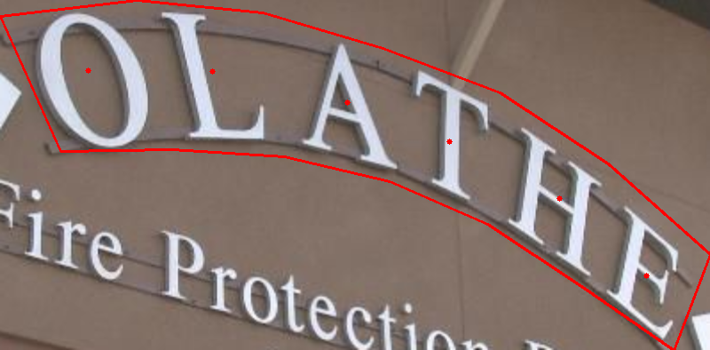

# Annotations-v2 (released on 2/27/2020)

New annotations. We add point annotation for each English character. Download links:

(https://pan.baidu.com/s/1Im3XmXs6W_5KGW543XX1MA PASSWORD: 7jwi)

or (https://drive.google.com/open?id=13sNLo3s8hO8_2ldkVapL7Q7LRBp8Yr-g) (Google Drive)



Example:

```
<Annotations>
|_ <image file="0200.jpg">
|  |_ <box height="197" left="131" top="49" width="399">
|  |  |_ <label>OLATHE</label>
|  |  |_ <segs>131,58,208,49,279,56,346,76,412,101,473,141,530,192,510,246,458,210,405,175,350,151,291,137,228,133,165,134</segs>
|  |  |_ <pts x="183" y="95" />
|  |  |_ <pts x="251" y="89" />
|  |  |_ <pts x="322" y="107" />
|  |  |_ <pts x="383" y="124" />
|  |  |_ <pts x="441" y="161" />
|  |  |_ <pts x="493" y="201" />
|  |_ </box>
|_ </image>
</Annotataions>
```
# Description

The SCUT-CTW1500 dataset can be downloaded through the following link:

(https://pan.baidu.com/s/1eSvpq7o PASSWORD: fatf)

or (https://1drv.ms/u/s!Aplwt7jiPGKilH4XzZPoKrO7Aulk) (OneDrive)

unzip the file in ROOT/data/ 
### Update
We updated the recognition annotations to ensure consistency between the recognition annotations and the detected annotation instances.
### Recognition Annotation
Recognition annotation of the SCUT-CTW1500 can be downloaded through the following link:[[GoogleDrive]](https://drive.google.com/file/d/1tHf-n86z4zFRaRNEc02EO-hZINZqkQpz/view?usp=sharing) [[BaiduYun]](https://pan.baidu.com/s/1MM7a-LX-ZBfNmb00iyUGTQ)

## Dataset Information

There are two file (train) and (test) inside ROOT/data/ctw1500/. Each one has four files.

a) **text_image** contains images files.

b) **text_label_curve** cotains annotation files with suffix ".txt"
* The file name is correspoinding to image file.
* Each line of the each file represents one text region.
* Each line has 32 values, representing xmin, ymin, xmax, ymax (of the circumsribed rectangle), pw1, ph1, ..., pw14, ph14.
* For Rectangle or Quadrangle bounding box, the extra 20 offsets are automatically created, so every bounding box has 32 values.

c) **trainval.txt** or **test.txt** are the list of the image file. 

d) **trainval_label_curve.txt** or **test_label_curve.txt** are the list of the label file.

## Labeling tool

Below shows how we label the data.


The labeling tool and manual can be downloaded through the following links:

Ubuntu label tool: https://1drv.ms/u/s!AradqGvJ8EbtbTxfwX5E-wfl0p4 (Onedrive)
                   https://pan.baidu.com/s/1omugYLafEyWhgwZ1BZ6ceQ (BaiduYun,  password: t8s1)

Windows label tool: https://1drv.ms/u/s!AradqGvJ8EbtbIUWrcN5zG19jE4 (Onedrive, run Windows_label_tool.exe)
                   https://pan.baidu.com/s/14OJD6rJF5olvEGsHuxiBhQ (BaiduYun,  password: 20oq)

Manual: https://1drv.ms/b/s!AradqGvJ8EbtahczW759VekS4lg (Onedrive)
        https://pan.baidu.com/s/1QA0Yky4MWkkYeVDDI5wA4A (BaiduYun, password: g8ll)

Note:
1. The SCUT-CTW1500 dataset can be used only for non-commercial research purpose.
